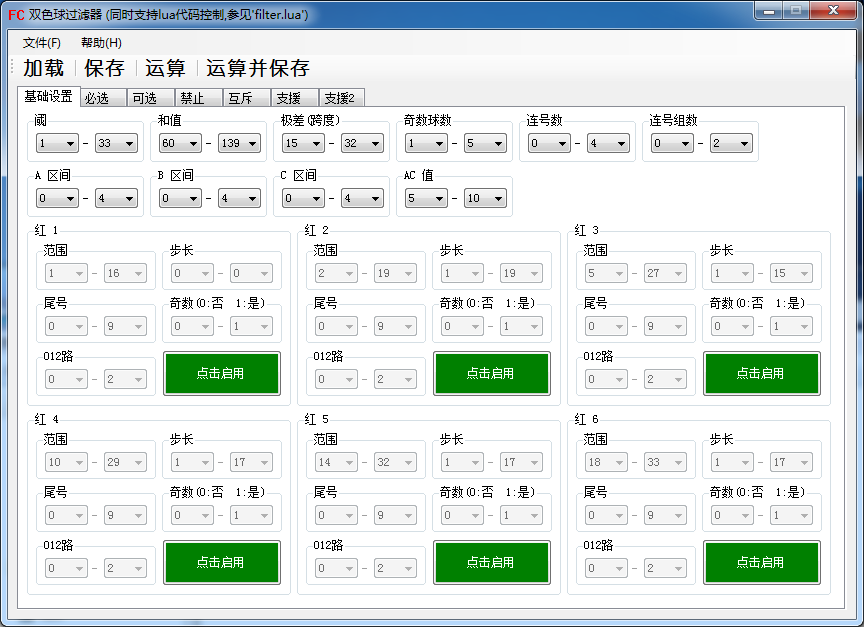
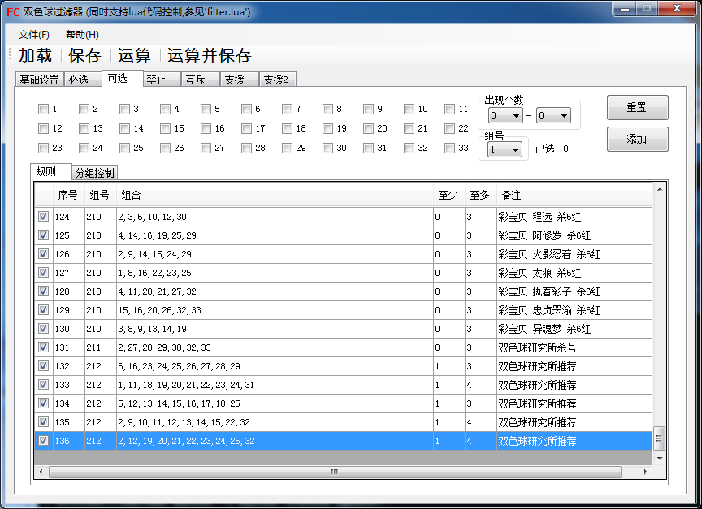
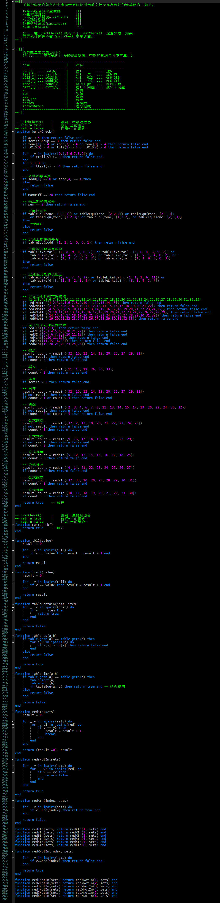

# FCTOOL_Bin
双色球过滤器，其角色相当于计算器而并非预测工具，支持计算任何关于双色球的数学信息。

## 说明
    1.此项目将视关注度而进行不定期更新。
    2.一般会在开奖当天上午（由于部分站点数据更新较晚）更新当期基础算法，而在开奖后对基础算法的计算结果进行统计。
    3.局限性说明，此项目旨在提供双色球计算工具（而非预测工具）以帮助用户计算任何复杂任务，其计算结果只依赖于用户算法而非此工具。
    4.计算结果输出样式可在 filter.lua 脚本中进行设置

## 图示

